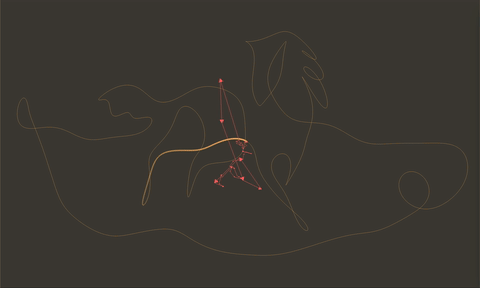
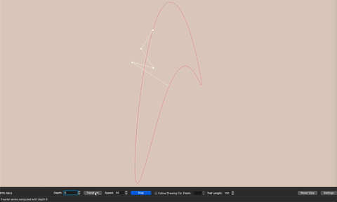

# Fourier Visualizer

A Python application that uses [Qt6](https://www.qt.io/product/qt6) and [OpenGL](https://registry.khronos.org/OpenGL/index_gl.php) to visualize the Fourier series representation of SVG images using rotating vectors. It allows you to load custom SVG files or examples, compute their Fourier series, and animate the drawing process with adjustable settings and real-time visualization.

## Table of Contents

- [Features](#features)
- [Demo](#demo)
- [Installation](#installation)
- [Usage](#usage)
- [Configuration](#configuration)
- [Dependencies](#dependencies)
- [License](#license)

## Features

- **Load Custom SVG Files**: Import your own SVG images to visualize their Fourier series representation.
- **Fourier Series Computation**: Adjust the depth of the Fourier series to control the level of detail.
- **Real-Time Animation**: Start, stop, and control the speed of the drawing animation.
- **Visualization Settings**: Customize the appearance, including colors, trail length, anti-aliasing, and more.
- **Follow Mode**: Focus on the drawing tip with adjustable zoom levels.
- **Trail Effect**: Enable or disable the drawing tip trail with customizable length and appearance.
- **User-Friendly Interface**: Clean and organized UI with grouped controls and settings dialog.
- **Performance Metrics**: Display the current frames per second (FPS) for performance monitoring.

## Demo






## Installation

### Prerequisites

- Python 3.11 or higher

### Clone the Repository

```bash
git clone https://github.com/ignacevau/fourier-visualizer.git
cd fourier-visualizer
```

### Create a Virtual Environment (Optional but Recommended)

```bash
python -m venv venv
source venv/bin/activate  # On Windows, use 'venv\Scripts\activate'
```

### Install Dependencies

```bash
pip install -r requirements.txt
```


## Usage

### Running the Application

```bash
python -m fourier_visualizer.main
```


### Loading an SVG File

1. Open the application.
2. Go to `File` > `Open SVG...` and select your SVG file.
3. Alternatively, load an example SVG via `File` > `Load Example`.

### Computing the Fourier Series

1. Set the desired `Depth` in the bottom control bar.
2. Click the `Transform` button to compute the Fourier series.

### Controlling the Animation

- **Play/Stop**: Use the `Play` button in the bottom bar to start or stop the animation.
- **Speed**: Adjust the `Speed` spin box to control the animation speed.

### Visualization Settings

- Access the settings dialog via `Settings` > `Settings...`.
- Customize visualization options such as colors, trail length, anti-aliasing passes, and arrow sizes.
- Click `Apply` to see changes immediately or `OK` to apply and close the dialog.

### View Controls

- **Follow Drawing Tip**: Enable the `Follow Drawing Tip` checkbox to focus on the drawing tip.
- **Zoom**: Adjust the `Zoom` level when follow mode is enabled.
- **Trail Length**: Set the `Trail Length` to control how long the drawing tip trail appears.

## Configuration

### Settings Dialog

The settings dialog allows you to customize various aspects of the visualization:

- **Visualization Options**:
  - Show or hide the Fourier drawing preview.
  - Adjust the Fourier preview color and opacity.
  - Show or hide the drawing tip trail.
  - Customize the trail color and width.
- **Anti-Aliasing**:
  - Set the number of anti-aliasing passes for smoother visuals.
- **Appearance Settings**:
  - Change the background color of the visualization.
- **Arrow Settings**:
  - Adjust the minimum and maximum sizes of the arrowheads.
  - Adjust the minimum and maximum widths of the arrow lines.

### Saving and Loading Configurations

*Currently, the application doesn't support saving and loading configurations. This should be supported in future versions.*

## Dependencies

- **Python 3.11+**
- **PyQt6**: For the GUI framework.
- **PyOpenGL**: To render graphics using OpenGL.
- **NumPy**: For numerical computations.
- **svg.path**: To parse SVG path data.


## License

This project is licensed under the MIT License. See the [LICENSE](LICENSE) file for details.


---

*Feel free to reach out if you have any questions or need assistance with the application.*